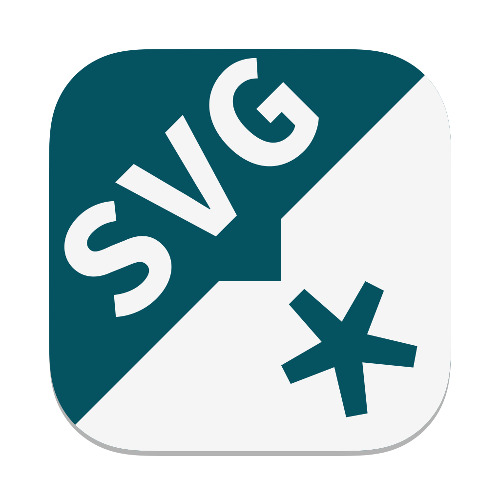
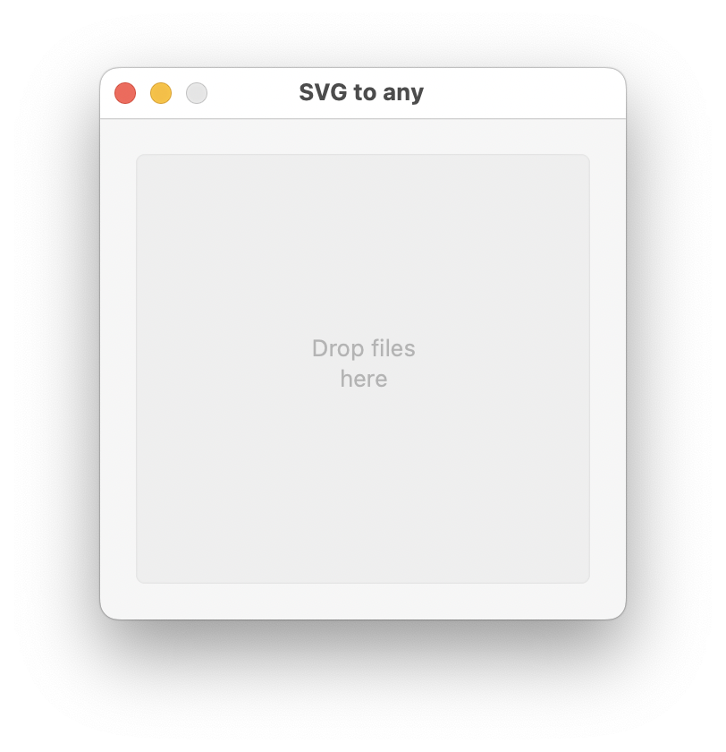
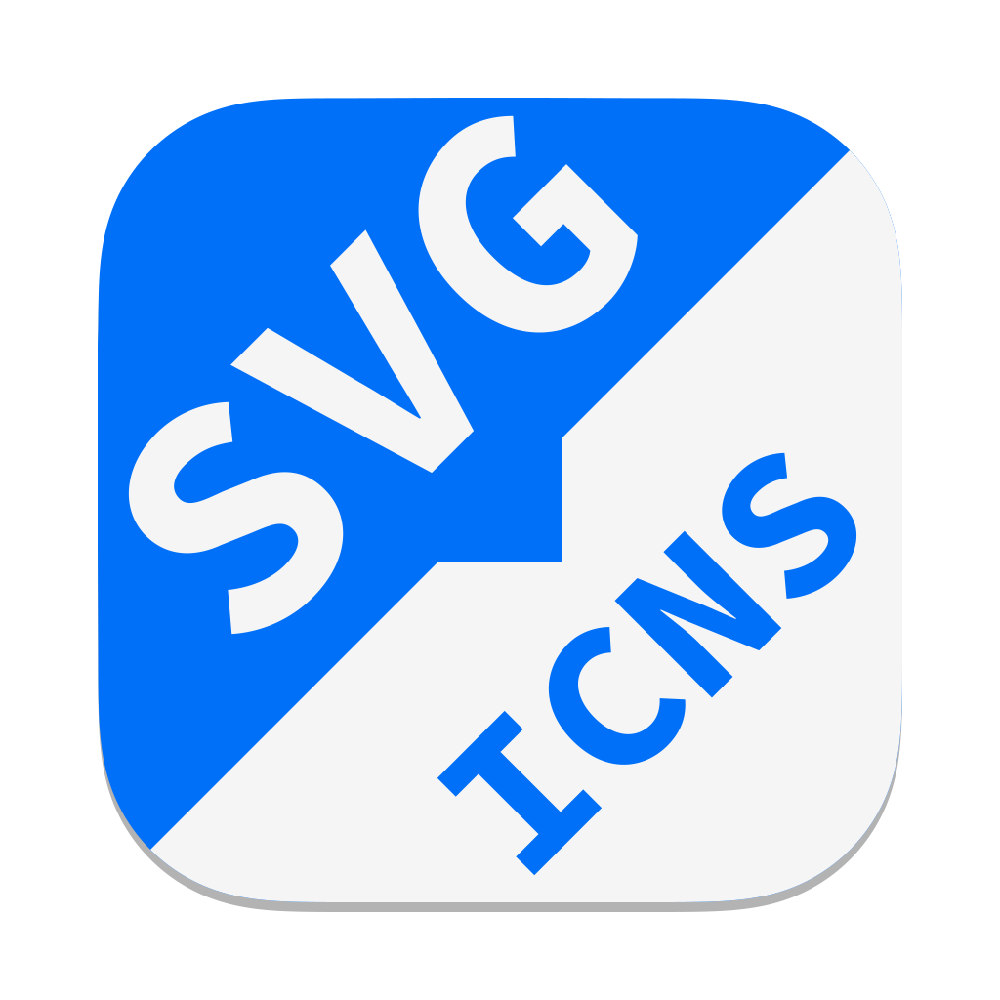
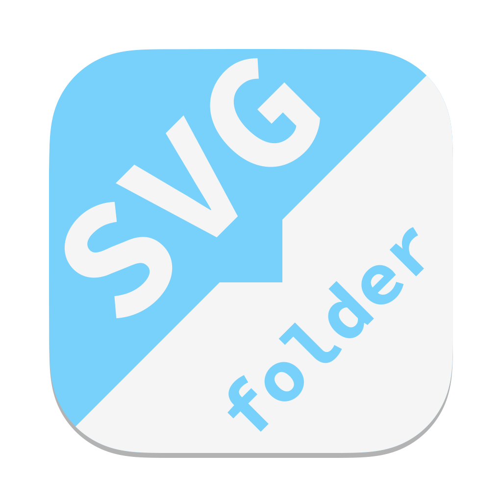
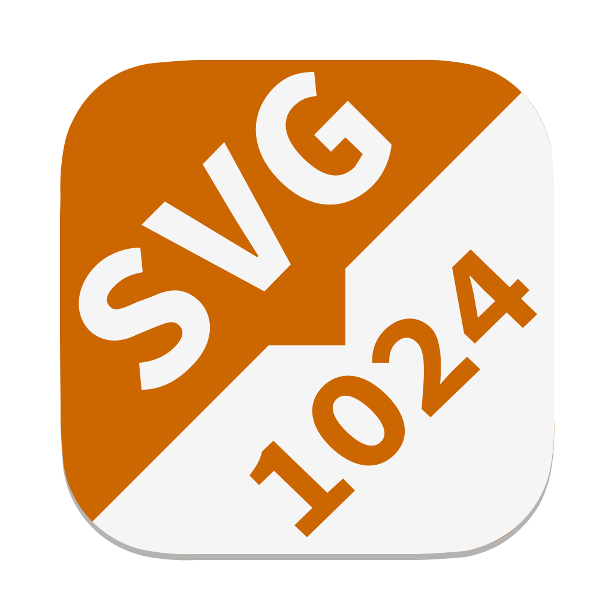

# SVG to any


> **Small Mac apps to convert SVG files to PNG, ICNS, and macOS folder icons.**

_Inutile, donc indispensable_

## Usage
### 1. Droplet


Launch the app and drag an SVG file on it to process it.

### 2. Open with
Right-click on an SVG file and select **Open with**, then choose one of the svg2any apps.

## Apps
#  SVG to PNG

Convert an SVG file to a PNG image with transparency, perfect for social networks that don't support SVGs.
The resulting PNG file is compressed using the slow but efficient Zopfli algorithm for images up to 1024 pixels, and the faster but less efficient zlib algorithm for larger images.

> **Important**
> --
> The compression used on images up to 1024 pixel is using **Zopfli** and takes **2~3 minutes** on a recent MacBook Pro M1 for a simple image. More complex images with lots of details, or less capable CPUs, will take way more time.

---

#  SVG to ICNS
Convert an SVG file to a macOS high-resolution icon.

---

#  SVG to folder
Set the containing folder icon to the SVG image.

---

#  SVG to 1024 x 1024
Resize an SVG to 1024 x 1024.

---

## SVG files
- Some SVGs work best when only the `viewBox` attribute is set.
- On macOS, the finder will show a better icon preview when the width and height attributes are not present.
	> Original SVG file:
	> ```xml
	> <svg width="1024" height="1024" [...]>
	> ```
	>
	>Better:
	> ```xml
	> <svg viewBox="0 0 1024 1024" [...]>
	> ```
- ICNS file are not compressed with `oxipng` since `iconutil` recompress them anyway.
- Compressing each PNG files before packing them with `iconutil` will result in larger ICNS files.

---

## Logs
Each app create a unique log file in `~/Library/Logs`.

---

# About
Why this?
1. I had an itch to scratch:
	- I like SVG files: they are tiny, can be optimized a lot, and look good at any resolution.
	- I also like my folder icons to be more visually descriptive as it makes me more productive.
	- However macOS can't use SVGs for icons, it works only with ICNS.
	- Switching to the console to run a script breaks my flow when I'm managing files and folders with Finder.
	- Compiling the binaries is a PITA when dealing with C code on legacy hardware (try to `brew install librsvg`), Rust works better.
2. This little project should help me with ysto-agent, our inventory command line tool written in Rust, for the Ystorian MVP:
	- Provide some kind of limited GUI.
	- Bundled in macOS apps that are more user-friendly than command line tools.
	- With universal binaries to support the modern arm64 architecture (Apple Silicon) as well as the legacy x64 (Intel).
	- Signed and notarized.
	- Available in the App Store for easier distribution.
	- Experiment to find the best app sandboxing and hardening options.
	- And understand which open source license works best with app distribution in the App Store.

---

## Licenses
The binaries included in the repository and included in the app bundles where built from these open source repositories:
- [rsvg-convert](https://gitlab.gnome.org/GNOME/librsvg) (LGPL)
- [oxipng](https://github.com/shssoichiro/oxipng) (MIT)
- [Platypus](https://github.com/sveinbjornt/Platypus) (BSD)

The rest is AGPL3, feel free to ask for another license if needed.

---

## Building
### Dependencies
svg2any depends on these binaries to build the apps:
- Build the macOS .app: [Platypus](https://github.com/sveinbjornt/Platypus)
- Convert SVG to PNG files: [rsvg-convert](https://gitlab.gnome.org/GNOME/librsvg)
- Compress PNG files: [oxipng](https://github.com/shssoichiro/oxipng)

### How to build the macOS apps
### 1. Install platypus
The command line tool for [Platypus](https://sveinbjorn.org/platypus) can be installed with [Homebrew](brew.sh):
```shell
brew install platypus
```

### 2. Build the apps
> Notes:
> - to help build universal apps, the `librsvg` and `oxipng` compiled binaries for x86_64 (Intel) and arm64 (Apple Silicon since M1) are present in this repository. To build these on your own, see below.
> - the build script optimizes the NIB in the bundles with the `optimize-nib` parameter. This requires Xcode to be installed and configured.

Build the apps with Platypus:
```sh
./build.sh
```


### How to (re-)build the required universal binaries
#### 1. Install Rust
See [rustup.rs](https://rustup.rs/)

#### 2. Download the sources and compile
Use these commands to compile the binaries and combine them to get the universal binaries.

### librsvg
```sh
git clone https://gitlab.gnome.org/GNOME/librsvg.git
cd librsvg
cargo build --release --target aarch64-apple-darwin
cargo build --release --target x86_64-apple-darwin
lipo target/aarch64-apple-darwin/release/rsvg-convert target/x86_64-apple-darwin/release/rsvg-convert -create -output rsvg-convert
```
The generated `rsvg-convert` universal binary can then be copied to `svg2any/`

### oxipng
```sh
git clone https://github.com/shssoichiro/oxipng.git
cd oxipng
cargo build --release --target aarch64-apple-darwin
cargo build --release --target x86_64-apple-darwin
lipo target/aarch64-apple-darwin/release/oxipng target/x86_64-apple-darwin/release/oxipng -create -output oxipng
```
The generated `oxipng` universal binary can then be copied to `svg2any/`


## Errors
### ibtool requires Xcode
When compiling a Platypus apps, this error message is shown at the step `Optimizing nib file`:
```
xcode-select: error: tool 'ibtool' requires Xcode, but active developer directory '/Library/Developer/CommandLineTools' is a command line tools instance
```

**Solution:**
Launch **Xcode**, open the **Preferences** pane, select the **Locations** tab and ensure **Command Line Tools** is not empty.
> Command Line Tools: Xcode 14.0.1 (14A400)
